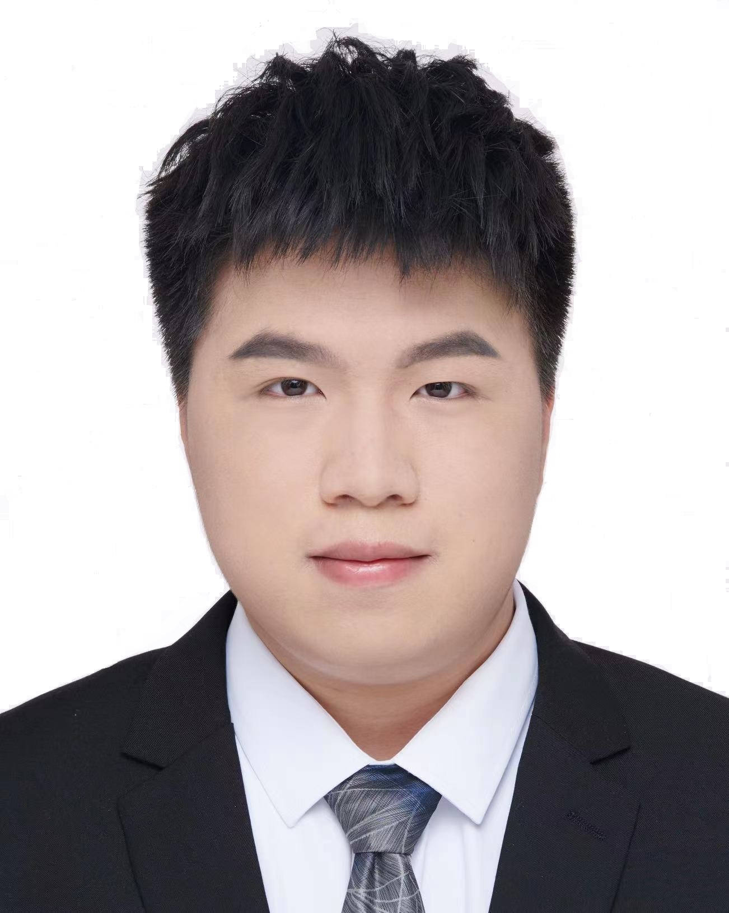
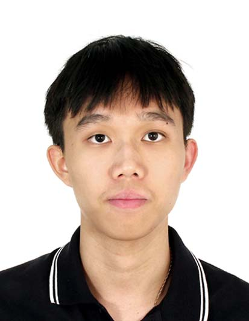
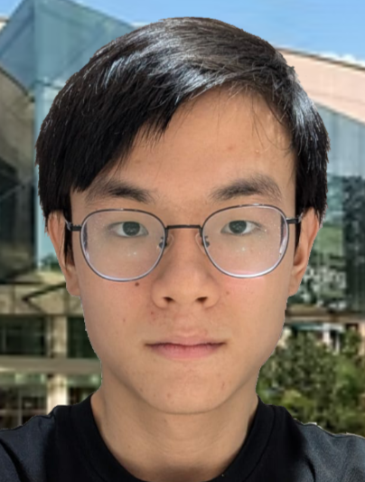
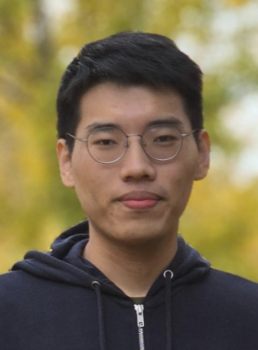

We are a team based in the [School of Computing, National University of Singapore](https://www.comp.nus.edu.sg).

## Project team

### He Haorui

[[github](https://github.com/feconi1024)]
[[portfolio](team/feconi1024.md)]

* Role: Project Advisor

### Yap Jun Yeu

[[github](http://github.com/yjunyeu)]

* Role: Developer
* Responsibilities: Code quality, Git expert

### Javen Tan Kang Le

[[github](http://github.com/javentankangle)]
[[portfolio](team/javentankangle.md)]

* Role: Developer
* Responsibilities: Integration, Refactoring and upgrade of model

### Sim Ray En Ryan

[[github](http://github.com/hackari)]
[[portfolio](team/hackari.md)]

* Role: Developer
* Responsibilities: Delegation of tasks, UI color design

### Lee Jia Wei

[[github](https://github.com/LeeJiaWei23)]
[[portfolio](team/leejiawei23.md)]

* Role: Developer
* Responsibilities: Testing, Integration
