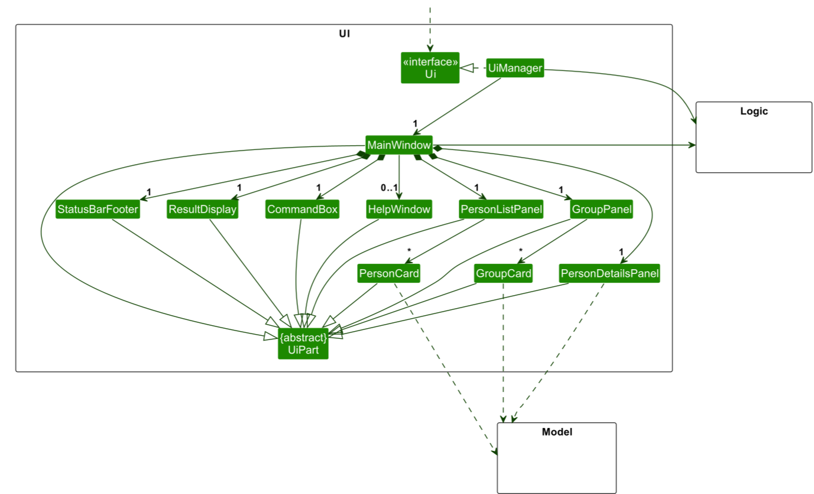
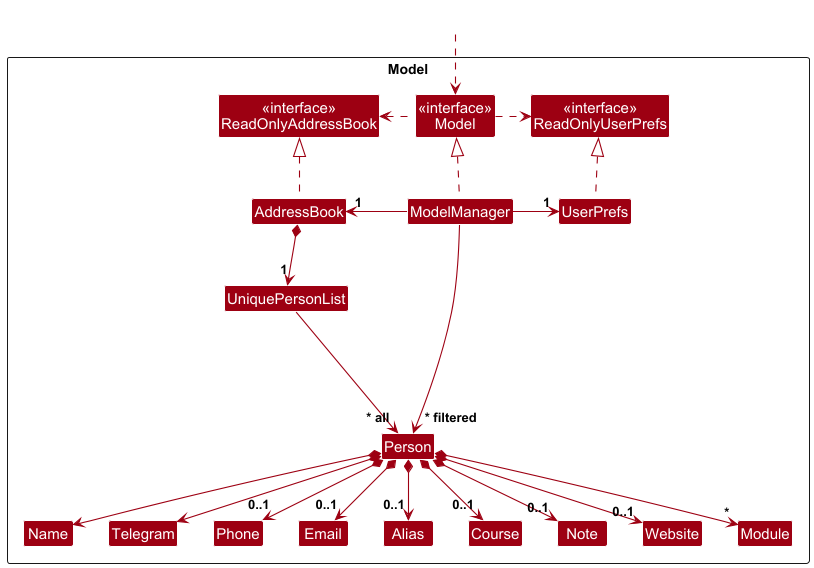
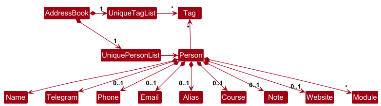
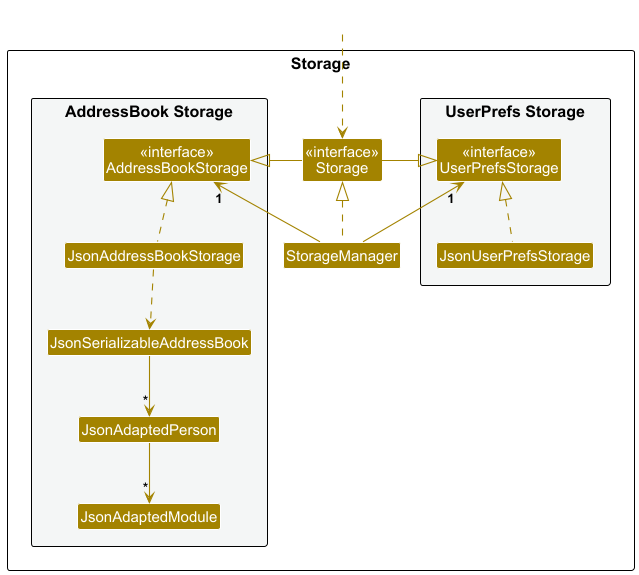
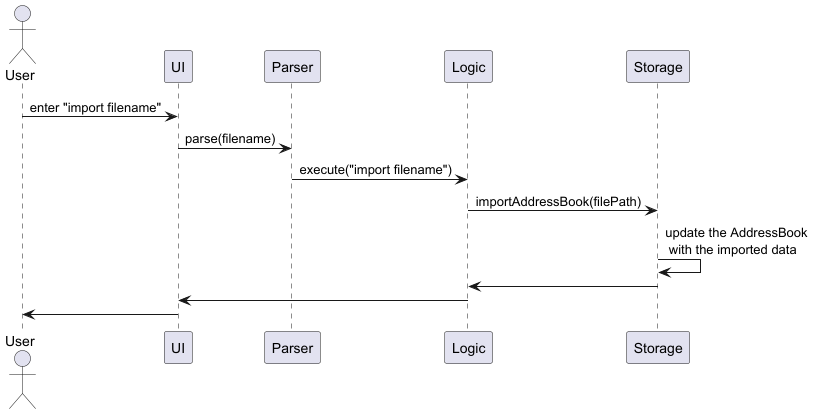

* Table of Contents
{:toc}

--------------------------------------------------------------------------------------------------------------------

## **Acknowledgements**

* {list here sources of all reused/adapted ideas, code, documentation, and third-party libraries -- include links to the original source as well}

--------------------------------------------------------------------------------------------------------------------

## **Setting up, getting started**

Refer to the guide [_Setting up and getting started_](SettingUp.md).

--------------------------------------------------------------------------------------------------------------------

## **Design**

### Architecture

The ***Architecture Diagram*** given above explains the high-level design of the App.

Given below is a quick overview of main components and how they interact with each other.

**Main components of the architecture**

**`Main`** (consisting of classes [`Main`](https://github.com/se-edu/addressbook-level3/tree/master/src/main/java/seedu/address/Main.java) and [`MainApp`](https://github.com/se-edu/addressbook-level3/tree/master/src/main/java/seedu/address/MainApp.java)) is in charge of the app launch and shut down.
* At app launch, it initializes the other components in the correct sequence, and connects them up with each other.
* At shut down, it shuts down the other components and invokes cleanup methods where necessary.

The bulk of the app's work is done by the following four components:

* [**`UI`**](#ui-component): The UI of the App.
* [**`Logic`**](#logic-component): The command executor.
* [**`Model`**](#model-component): Holds the data of the App in memory.
* [**`Storage`**](#storage-component): Reads data from, and writes data to, the hard disk.

[**`Commons`**](#common-classes) represents a collection of classes used by multiple other components.

**How the architecture components interact with each other**

The *Sequence Diagram* below shows how the components interact with each other for the scenario where the user issues the command `delete 1`.

Each of the four main components (also shown in the diagram above),

* defines its *API* in an `interface` with the same name as the Component.
* implements its functionality using a concrete `{Component Name}Manager` class (which follows the corresponding API `interface` mentioned in the previous point.

For example, the `Logic` component defines its API in the `Logic.java` interface and implements its functionality using the `LogicManager.java` class which follows the `Logic` interface. Other components interact with a given component through its interface rather than the concrete class (reason: to prevent outside component's being coupled to the implementation of a component), as illustrated in the (partial) class diagram below.

The sections below give more details of each component.

### UI component

The **API** of this component is specified in [`Ui.java`](https://github.com/se-edu/addressbook-level3/tree/master/src/main/java/seedu/address/ui/Ui.java)

The UI consists of a `MainWindow` that is made up of parts e.g.`CommandBox`, `ResultDisplay`, `PersonListPanel`, `StatusBarFooter` etc. All these, including the `MainWindow`, inherit from the abstract `UiPart` class which captures the commonalities between classes that represent parts of the visible GUI.

The `UI` component uses the JavaFx UI framework. The layout of these UI parts are defined in matching `.fxml` files that are in the `src/main/resources/view` folder. For example, the layout of the [`MainWindow`](https://github.com/se-edu/addressbook-level3/tree/master/src/main/java/seedu/address/ui/MainWindow.java) is specified in [`MainWindow.fxml`](https://github.com/se-edu/addressbook-level3/tree/master/src/main/resources/view/MainWindow.fxml)

The `UI` component,

* executes user commands using the `Logic` component.
* listens for changes to `Model` data so that the UI can be updated with the modified data.
* keeps a reference to the `Logic` component, because the `UI` relies on the `Logic` to execute commands.
* depends on some classes in the `Model` component, as it displays `Person` object residing in the `Model`.

### Logic component

**API** : [`Logic.java`](https://github.com/se-edu/addressbook-level3/tree/master/src/main/java/seedu/address/logic/Logic.java)

Here's a (partial) class diagram of the `Logic` component:

The sequence diagram below illustrates the interactions within the `Logic` component, taking `execute("delete 1 2")` API call as an example.

:information_source: **Note:** The lifeline for `DeleteCommandParser` should end at the destroy marker (X) but due to a limitation of PlantUML, the lifeline continues till the end of diagram.

How the `Logic` component works:

1. When `Logic` is called upon to execute a command, it is passed to an `AddressBookParser` object which in turn creates a parser that matches the command (e.g., `DeleteCommandParser`) and uses it to parse the command.
1. This results in a `Command` object (more precisely, an object of one of its subclasses e.g., `DeleteCommand`) which is executed by the `LogicManager`.
1. The command can communicate with the `Model` when it is executed (e.g. to delete a person). 
   Note that although this is shown as a single step in the diagram above (for simplicity), in the code it can take several interactions (between the command object and the `Model`) to achieve.
1. The result of the command execution is encapsulated as a `CommandResult` object which is returned back from `Logic`.

Here are the other classes in `Logic` (omitted from the class diagram above) that are used for parsing a user command:

How the parsing works:
* When called upon to parse a user command, the `AddressBookParser` class creates an `XYZCommandParser` (`XYZ` is a placeholder for the specific command name e.g., `AddCommandParser`) which uses the other classes shown above to parse the user command and create a `XYZCommand` object (e.g., `AddCommand`) which the `AddressBookParser` returns back as a `Command` object.
* All `XYZCommandParser` classes (e.g., `AddCommandParser`, `DeleteCommandParser`, ...) inherit from the `Parser` interface so that they can be treated similarly where possible e.g, during testing.

### Model component
**API** : [`Model.java`](https://github.com/se-edu/addressbook-level3/tree/master/src/main/java/seedu/address/model/Model.java)

The `Model` component,

* stores the address book data i.e., all `Person` objects (which are contained in a `UniquePersonList` object) and all `Group` objects (which are contained in a `UniqueGroupList` object).
* stores the currently 'selected' `Person` objects (e.g., results of a search query) as a separate _filtered_ list which is exposed to outsiders as an unmodifiable `ObservableList<Person>` that can be 'observed' e.g. the UI can be bound to this list so that the UI automatically updates when the data in the list change.
* stores a `UserPref` object that represents the user’s preferences. This is exposed to the outside as a `ReadOnlyUserPref` objects.
* does not depend on any of the other three components (as the `Model` represents data entities of the domain, they should make sense on their own without depending on other components)

:information_source: **Note:** An alternative (arguably, a more OOP) model is given below. It has a `Module` list in the `AddressBook`, which `Person` references. This allows `AddressBook` to only require one `Module` object per unique module, instead of each `Person` needing their own `Module` objects. 

### Storage component

**API** : [`Storage.java`](https://github.com/se-edu/addressbook-level3/tree/master/src/main/java/seedu/address/storage/Storage.java)

The `Storage` component,
* can save both address book data and user preference data in JSON format, and read them back into corresponding objects.
* inherits from both `AddressBookStorage` and `UserPrefStorage`, which means it can be treated as either one (if only the functionality of only one is needed).
* depends on some classes in the `Model` component (because the `Storage` component's job is to save/retrieve objects that belong to the `Model`)

### Common classes

Classes used by multiple components are in the `seedu.address.commons` package.

--------------------------------------------------------------------------------------------------------------------

## **Implementation**

This section describes some noteworthy details on how certain features are implemented.

### Import feature
#### Implementation
The Import feature allows users to load an existing address book from a JSON file into the application. This feature provides a seamless way to integrate external data and ensures that users can transfer their address book information efficiently without manual entry.

This high-level sequence diagram outlines the flow of interactions between the components involved in the import functionality. Here's an elaboration on each part of the diagram:

1. User Input:
   User initiates the import process by entering the command import filename via the UI. This command indicates the user's intention to import an address book from a file located at the specified filename path.

2. UI - Parsing the Command:
   The UI receives the user's input and sends the command (import filename) to the Parser.

3. Parser - Passing Command to Logic:
   After parsing the input, the Parser creates the appropriate Logic command and forwards the parsed information (like the file path) to Logic for execution. The Logic component is the core handler that manages the overall operation of importing the data and updating the application state.

4. Logic - Invoking Storage:
   Logic interacts with Storage to begin the import process. Specifically, it calls importAddressBook(filePath), passing the file path of the address book file that needs to be imported.

5. Storage - Updating AddressBook:
   The Storage component reads the JSON (or other file format) data from the specified file and deserializes it into the AddressBook model.
   Once the data is read successfully, Storage updates the internal AddressBook with the newly imported data, effectively replacing or merging the previous address book data with the imported data.

6. Storage - Returning Control to Logic:
   After the AddressBook has been updated, Storage sends a response back to Logic, confirming that the import was successful and the address book has been updated.

7. Logic - Returning Status to UI:
   Logic then communicates with the UI to update it on the status of the import operation. This can be either a success message or an error message, depending on whether the operation was successful or if there were issues (e.g., file format errors).

8. UI - Displaying Result to User:
   Finally, the UI displays the result to the User, letting them know whether the import was successful or if there were any errors encountered during the process. This step ensures that the user is kept informed about the status of the operation.

--------------------------------------------------------------------------------------------------------------------

## **Documentation, logging, testing, configuration, dev-ops**

* [Documentation guide](Documentation.md)
* [Testing guide](Testing.md)
* [Logging guide](Logging.md)
* [Configuration guide](Configuration.md)
* [DevOps guide](DevOps.md)

--------------------------------------------------------------------------------------------------------------------

## **Appendix: Requirements**

### Product scope

**Target user profile**:
NUS students

* has a need to manage a significant number of contacts (e.g. classmates from different modules, CCA mates, etc)
* prefer desktop apps over other types
* can type fast
* prefers typing to mouse interactions
* is reasonably comfortable using CLI apps

**Value proposition**: A fast and efficient contact management tool for NUS students.
NUSConnect helps students quickly add, organise and find contacts with minimal effort.

### User Stories

<table>
    <thead>
        <tr>
            <th>Priority</th>
            <th>As a …</th>
            <th>I want to …</th>
            <th>So that I can …</th>
        </tr>
    </thead>
    <tbody>
        <tr class="high-priority">
            <td>***</td>
            <td>Student</td>
            <td>Link multiple contact methods to a single person (e.g., telegram, phone)</td>
            <td>Communicate through multiple channels as needed</td>
        </tr>
        <tr class="high-priority">
            <td>***</td>
            <td>Student</td>
            <td>Search for a contact by name</td>
            <td>Retrieve contact details quickly</td>
        </tr>
        <tr class="high-priority">
            <td>***</td>
            <td>Student</td>
            <td>Search for a contact by module</td>
            <td>Retrieve contact details quickly</td>
        </tr>
        <tr class="high-priority">
            <td>***</td>
            <td>Student</td>
            <td>Delete a contact from the address book</td>
            <td>Remove outdated or unnecessary contacts</td>
        </tr>
        <tr class="high-priority">
            <td>***</td>
            <td>Student</td>
            <td>Edit a contact’s details</td>
            <td>Ensure information remains accurate and up to date</td>
        </tr>
        <tr class="high-priority">
            <td>***</td>
            <td>Student</td>
            <td>View a contact’s profile with their full details</td>
            <td>Access comprehensive details when needed</td>
        </tr>
        <tr class="medium-priority">
            <td>**</td>
            <td>Student</td>
            <td>Delete all contacts in bulk if needed</td>
            <td>Reset my contact list when necessary</td>
        </tr>
        <tr class="medium-priority">
            <td>**</td>
            <td>Student</td>
            <td>Delete multiple contacts from the address book</td>
            <td>Remove outdated or unnecessary contacts efficiently</td>
        </tr>
        <tr class="medium-priority">
            <td>**</td>
            <td>Student</td>
            <td>Add personal notes to a contact’s profile</td>
            <td>Preserve important contextual information about a contact</td>
        </tr>
        <tr class="medium-priority">
            <td>**</td>
            <td>Project group leader</td>
            <td>Create a contact group specific to a project</td>
            <td>Easily access project members’ details for coordination</td>
        </tr>
        <tr class="low-priority">
            <td>*</td>
            <td>Student</td>
            <td>Export my contact list</td>
            <td>Share it with others or to save it</td>
        </tr>
        <tr class="low-priority">
            <td>*</td>
            <td>Student</td>
            <td>Import a contact list</td>
            <td>Load previously saved or other's versions of the contact list</td>
        </tr>
    </tbody>
</table>

### Use cases

(For all use cases below, the **System** is the `NUSConnect` and the **Actor** is the `user`, unless specified otherwise)

**Use case: UC1 - Adding a person**

**MSS**

1.  User request to add a person.
2.  NUSConnect adds the person.

    Use case ends.

**Extensions**

* 1a. The person's name or Telegram parameter is not specified.

    1a1. NUSConnect shows an error message.

    Use case resumes at step 1.

* 1b. Any of the person's fields that are specified do not match the required pattern.
  
  1b1. NUSConnect shows an error message.
  
  Use case resumes at step 1.

* 1c. The person already exists.

  1c1. NUSConnect shows an error message.
 
  Use case resumes at step 1.

**Use case: UC2 - Editing a person**

**MSS**

1.  User requests to edit a specific contact in the list.
2.  NUSConnect edit the contact.

    Use case ends.

**Extensions**

* 1a. The list is empty.

  Use case ends.

* 1b. The given index is invalid.

  1b1. NUSConnect shows an error message. 

  Use case resumes at step 1.
  
* 1c. The person's name or Telegram is edited, but an invalid value is given. 

  1c1. NUSConnect shows an error message.

  Use case resumes at step 1.

* 1d. The person is being edited to another contact that already exists.

  1d1. NUSConnect shows an error message.

  Use case resumes at step 1.

* 1e. The edits do not change the person.

  1e1. NUSConnect shows an message.

  Use case ends.

**Use case: UC3 - Delete a person**

**MSS**

1. User requests to delete a specific person in the list.
2. NUSConnect deletes the person.

    Use case ends.

**Extensions**

* 1a. The list is empty.

  Use case ends.

* 1b. The given index is invalid.

  1b1. NUSConnect shows an error message.

  Use case resumes at step 1.

**Use case: UC4 - Delete multiple persons**

**MSS**

1. User requests to delete a list of specific persons in the list.
2. NUSConnect deletes the persons.

   Use case ends.

**Extensions**

* 1a. The list is empty.

  Use case ends.

* 1b. At least one of the given indices is invalid.

  1b1. NUSConnect shows an error message.

  Use case resumes at step 1.

**Use case: UC5 - Clearing all entries**

**MSS**

1. User requests to clear NUSConnect.
2. NUSConnect clears the address book.

   Use case ends.

**Use case: UC6 - Creating a group**

**MSS**

1. User requests to create a group
2. NUSConnect creates the group

   Use case ends.

**Use case: UC7 - Deleting a group**

**MSS**

1. NUSConnect shows a list of groups
2. User requests to delete a specific group in the group list
3. NUSConnect deletes the group

   Use case ends.

**Extensions**

* 1a. The group list is empty.

  Use case ends.

* 2a. The given group index is invalid.

    * 2a1. NUSConnect shows an error message.

      Use case resumes at step 1.

**Use case: UC8 - Adding a person to a group**

**MSS**

1. User requests to list persons
2. NUSConnect shows a list of persons
3. User requests to add a person to a group
4. NUSConnect adds the person to the chosen group

   Use case ends.

**Extensions**

* 2a. The list is empty.

  Use case ends.

* 3a. Either the person index or group index is invalid.

    * 3a1. NUSConnect shows an error message.

      Use case resumes at step 2.

**Use case: UC9 - Listing directory**

**MSS**

1.  User request to list persons
2.  NUSConnect shows the list of persons

    Use case ends.

**Extensions**

* 2a. The list is empty.

  2a1. NUSConnect shows a message.

  Use case ends.

**Use case: UC10 - Locating persons by name**

**MSS**

**Use case: UC11 - Locating persons by module**

**MSS**

**Use case: UC12 - Viewing person details**

**MSS**

1.  User request to view a person.
2.  NUSConnect shows the details of that person.

    Use case ends.

**Extensions**

* 1a. The list is empty.

  Use case ends.

* 2a. The given index is invalid.

    * 2a1. NUSConnect shows an error message.

      Use case resumes at step 1.

**Use case: UC13 - Sorting the address book**

**MSS**

**Use case: UC14 - Exporting the current address book**

**MSS**
* 1. User requests to export a file
* 2. NUSConnect exports the file successfully

Use case ends.

**Extensions**
* 2a File name is invalid
    * 2a1 NUSConnect fails to export to the file

      Use case ends.

* 2b File path is invalid
    * 2b1 NUSConnect fails to export to the file

      Use case ends.
  
* 2c File path has insufficient write permissions
    * 2c1 NUSConnect fails to export to the file

      Use case ends.
  
**Use case: UC15 - Importing an address book**

**MSS**
* 1. User requests to import a file
* 2. NUSConnect imports the file successfully

   Use case ends.

**Extensions**
* 2a File name is invalid
  * 2a1 NUSConnect fails to import the file

    Use case ends.

* 2b File path is invalid
  * 2b1 NUSConnect fails to import the file
    
    Use case ends.
  
* 2c File data is invalid
  * 2c1 NUSConnect fails to import the file

    Use case ends.

### Non-Functional Requirements

1.  Should work on any _mainstream OS_ as long as it has Java `17` or above installed.
2.  Should be able to hold up to 1000 persons without a noticeable sluggishness in performance for typical usage.
3.  A user with above average typing speed for regular English text (i.e. not code, not system admin commands) should be able to accomplish most of the tasks faster using commands than using the mouse.
4.  Should not require additional installation or system modifications beyond Java.
5.  There should not be loss of data while using the application.

### Glossary

* **Mainstream OS**: Windows, Linux, Unix, MacOS
* **Major**: A primary major of a student, such as Computer Science.
* **Module**: An NUS Module, such as CS2103T.
* **Group**: A group of people in the address book.

--------------------------------------------------------------------------------------------------------------------

## **Appendix: Instructions for manual testing**

Given below are instructions to test the app manually.

:information_source: **Note:** These instructions only provide a starting point for testers to work on;
testers are expected to do more *exploratory* testing.

### Launch and shutdown

1. Initial launch

   1. Download the jar file and copy into an empty folder

   1. Double-click the jar file Expected: Shows the GUI with a set of sample persons. The window size may not be optimum.

1. Saving window preferences

   1. Resize the window to an optimum size. Move the window to a different location. Close the window.

   1. Re-launch the app by double-clicking the jar file. 
       Expected: The most recent window size and location is retained.

### Adding people

1. Adding a person with only required fields Name and Telegram.
   1. Prerequisites: The test persons below do not already exist.
   2. Test case: `add n/John Doe t/@johndoe` 
      Expected: This person is added to NUSConnect.
   2. Test case: `add n/John Doe Sr. the 2nd S/O Ah-k'ow t/@johndoe` 
      Expected: This person is added to NUSConnect.
   2. Test case: `add n/1John Doe t/@johndoe` 
      Expected: No person is added. An error message indicates the pattern Name should match.
   2. Test case: `add n/John Doe* t/@johndoe` 
      Expected: No person is added. An error message indicates the pattern Name should match.
   2. Test case: `add n/John Doe t/johndoe` 
      Expected: No person is added. An error message indicates the pattern Telegram should match.
   2. Test case: `add n/John Doe t/@john` 
      Expected: No person is added. An error message indicates the pattern Telegram should match.
   2. Test case: `add n/1John Doe t/@john` 
      Expected: No person is added. An error message indicates the pattern Name should match.
2. Adding a person with all required fields and some optional fields.
    1. Prerequisites: The test persons below do not already exist.
   2. Test case: `add n/John Doe t/@johndoe p/98765432` 
      Expected: This person is added to NUSConnect.
   2. Test case: `add n/John Doe t/@johndoe p/12345678` 
      Expected: No person is added. An error message indicates the pattern Phone should match.
   2. Test case: `add n/John Doe t/@johndoe p/+65 9876 5432` 
      Expected: No person is added. An error message indicates the pattern Phone should match.
   2. Test case: `add n/John Doe t/@johndoe m/CS2101` 
      Expected: This person is added to NUSConnect.
   2. Test case: `add n/John Doe t/@johndoe m/CS2101 m/CS2103T m/GESS1006 m/CS2100DE` 
      Expected: This person is added to NUSConnect.
   2. Test case: `add n/John Doe t/@johndoe m/CS50` 
      Expected: No person is added. An error message indicates the pattern Module should match.
   2. Test case: `add n/John Doe t/@johndoe m/CS2101 m/CS50` 
      Expected: No person is added. An error message indicates the pattern Module should match.
   2. Test case: `add n/John Doe t/@johndoe p/12345678 m/CS2101 m/CS50` 
      Expected: No person is added. An error message indicates the pattern Phone should match.
3. Adding a person without required fields Name and Telegram.
   1. Test case: `add t/@johndoe` 
       Expected: No person is added. An error message indicates that the command format is invalid.
   2. Test case: `add n/John Doe` 
      Expected: No person is added. An error message indicates that the command format is invalid.
   1. Test case: `add t/@johndoe p/98765432` 
      Expected: No person is added. An error message indicates that the command format is invalid.
   2. Test case: `add n/John Doe p/98765432` 
      Expected: No person is added. An error message indicates that the command format is invalid.
3. Adding a person with a non-existent field.
    1. Prerequisites: The test persons below do not already exist.
   2. Test case: `add n/John Doe t/@johndoe height/180` 
      Expected: No person is added. An error message indicates the pattern Telegram should match.
   2. Test case: `add t/@johndoe n/John Doe height/180` 
      Expected: No person is added. An error message indicates the pattern Name should match.

### Editing people

1. Editing a person for one field.
    1. Prerequisites: There is a person to edit, and the test persons below do not already exist.
   1. Test case: `edit 1 t/@johndoe2` 
      Expected: The person at index 1 is updated.
   2. Test case: `edit 1 n/John Doe2` 
      Expected: The person at index 1 is updated.
   1. Test case: `edit 1 p/` 
      Expected: The person at index 1 is updated.
   2. Test case: `edit 1 m/` 
      Expected: The person at index 1 is updated.
   1. Test case: `edit 1 p/99998888` 
      Expected: The person at index 1 is updated.
   2. Test case: `edit 1 m/CS2101` 
      Expected: The person at index 1 is updated.
   1. Test case: `edit 1 n/` 
      Expected: No person is added. An error message indicates the pattern Telegram should match.
   2. Test case: `edit 1 t/` 
      Expected: No person is added. An error message indicates the pattern Name should match.
2. Editing a person for multiple fields.
    1. Prerequisites: There is a person to edit, and the test persons below do not already exist.
   1. Test case: `edit 1 n/John Doe2 t/@johndoe2` 
      Expected: The person at index 1 is updated.
   2. Test case: `edit 1 p/99998888 m/CS2101 m/CS2103T` 
      Expected: The person at index 1 is updated.
   1. Test case: `edit 1 n/John Doe2 t/@johndoe2 p/99998888 m/` 
      Expected: The person at index 1 is updated.
   2. Test case: `edit 1 n/ t/@johndoe2 p/99998888 m/` 
      Expected: No person is added. An error message indicates the pattern Name should match.
   1. Test case: `edit 1 n/John Doe2 t/ p/99998888 m/` 
      Expected: No person is added. An error message indicates the pattern Telegram should match.
   2. Test case: `edit 1 n/John Doe2 t/@johndoe2 p/12345678 m/` 
      Expected: No person is added. An error message indicates the pattern Phone should match.

### Deleting people

1. Deleting a person.
   1. Prerequisites: List all persons using the `list` command. There are three persons in the list.
   1. Test case: `delete 1` 
      Expected: The first person is deleted from the list.
   1. Test case: `delete 2` 
      Expected: The second person deleted from the list.
   1. Test case: `delete 0` 
      Expected: No person is deleted. An error message indicates that the command format is invalid.
   1. Test case: `delete 4` 
      Expected: No person is deleted. An error message indicates that `4` is an invalid index.

1. Deleting multiple persons.
    1. Prerequisites: List all persons using the `list` command. Three persons in the list.
    1. Test case: `delete 1 2 3` 
       Expected: The first, second, and third persons are deleted from the list.
    1. Test case: `delete 1 2 1 2` 
       Expected: The first and second persons are deleted from the list.
    1. Test case: `delete 1 2 3 4` 
       Expected: No person is deleted. An error message indicates that `4` is an invalid index.
    1. Test case: `delete 0 1 2 3` 
       Expected: No person is deleted. An error message indicates that the command format is invalid.
    1. Test case: `delete 0 4` 
       Expected: No person is deleted. An error message indicates that the command format is invalid.

### Creating a group

### Deleting a group

### Adding a person to a group

### Locating persons by name or modules

### Sorting the address book

### Exporting the current address book
1. Exporting to a file
   1. Test case: `export addressbook.json` 
      Expected: Export successful.
   2. Test case: `export .json` 
      Expected: Export fail. An error message indicate that file name is invalid.
   3. Test case: `export addressbook.txt` 
      Expected: Export fail. An error message indicate that file name is invalid.
   4. Test case: `export addressbook.csv` 
      Expected: Export fail. An error message indicate that file name is invalid.
   5. Test case `export *.json` 
      Expected: Export fail. An error message indicate that file path is invalid.
   6. Test case `export 123:addressbook.json` 
      Expected: Export fail. An error message indicate that file path is invalid.
   7. Test case `export C:/Windows/System32/addressbook.json` 
      Expected: Export fail. An error message indicate that permission is denied to write to that file path.

### Importing an address book
1. Importing a file
   1. Prerequisites: Manually create `addressbook.json` and `.json` with valid JSON file data, `invalidAddressbook.json` with invalid JSON file data, and `empty.json` with no data in current folder.
   2. Test case: `import addressbook.json` 
      Expected: Import successful.
   3. Test case: `import .json` 
      Expected: Import fail. An error message indicate that file name is invalid.
   4. Test case: `import addressbook.txt` 
      Expected: Import fail. An error message indicate that file name is invalid.
   5. Test case: `import addressbook.csv` 
      Expected: Import fail. An error message indicate that file name is invalid.
   6. Test case `import *.json` 
      Expected: Import fail. An error message indicate that file path is invalid.
   7. Test case `import 123:addressbook.json` 
      Expected: Import fail. An error message indicate that file path is invalid.
   8. Test case: `import invalidAddressbook.json`
      Expected: Import fail. An error message indicate that JSON file data is invalid
   9. Test case: `import empty.json`
       Expected: Import fail. An error message indicate that JSON file data is invalid
--------------------------------------------------------------------------------------------------------------------

## **Appendix: Planned Enhancements**

Team size: 5

1. **Make group delete** more versatile. The current group delete command is only able to delete the entire group. This
is too restrictive. We plan to make `group delete` be able to delete specific contact from a group. Adjust `group delete`
to accept this format `group delete PERSON_INDEX from GROUP_INDEX`  so that we can remove specific contact.

2. Currently, every contact's details like `telegram`, `email` and others are stored in the group array in `addressbook.json`. Since only `name` is typically used within
group context, we plan to update the group structure in storage to store only the contact's name. This keeps the JSON smaller.

3. Enhance `group add` to check if a contact is taking this module before adding to a group that is from another module. Currently, no such checks are done.
We plan to implement a check like if a group is associated with a specific module, only contacts who are enrolled in that module can be added.

4. Allow multiple contacts to be added in one `group add` command. Currently, it only supports adding one contact at a time.
We plan to extend the command syntax (e.g. `group add 1 2 3 to 2`) so multiple contacts can be added to a group in a single command.

5. Users currently have to run individual `edit` commands to add a module to each contact. We plan to allow users to 
add a single module to multiple contacts simultaneously using `edit 1 2 3 4 m/CS2103T`.

6. Enhance `find` with a flag for exact string matches. Currently, find only supports partial string matches for both names and modules which may lead to unwanted results. 
This enhancement allow users to find contacts more accurately when some names or module codes contain similar substrings (eg `CS2103T` and `CS2103`).
