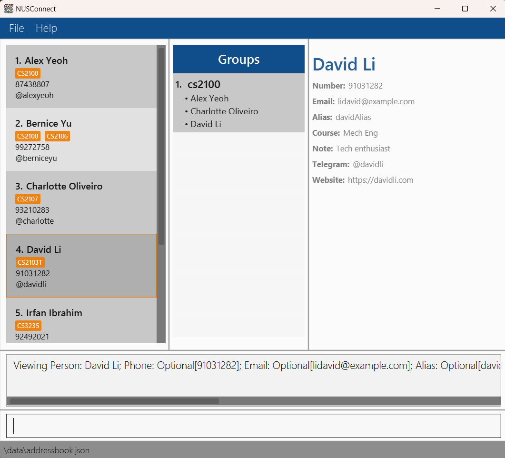
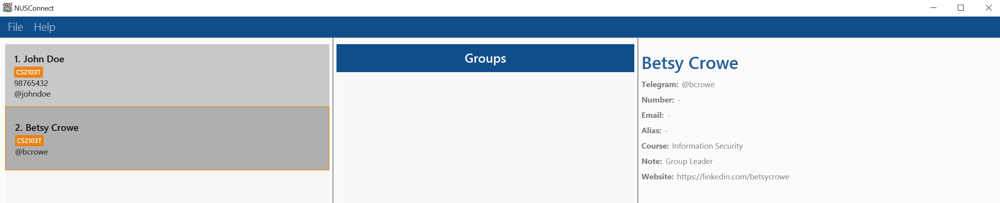
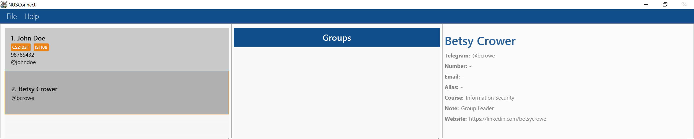
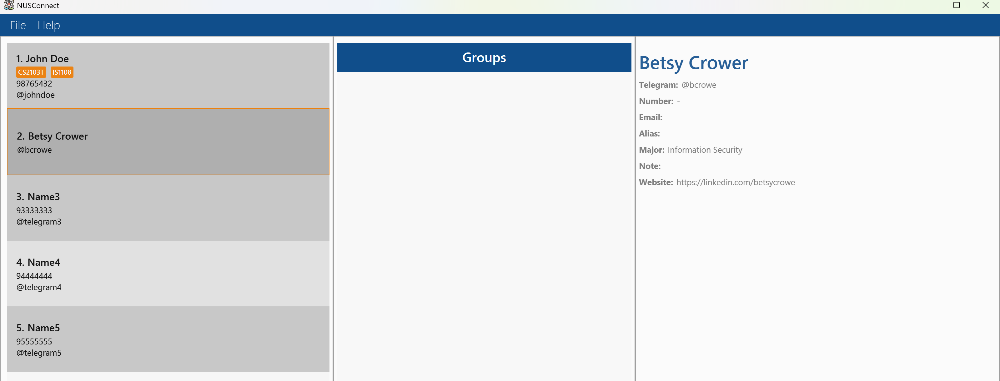
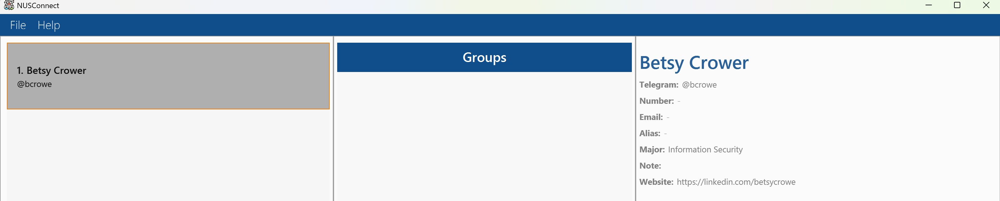
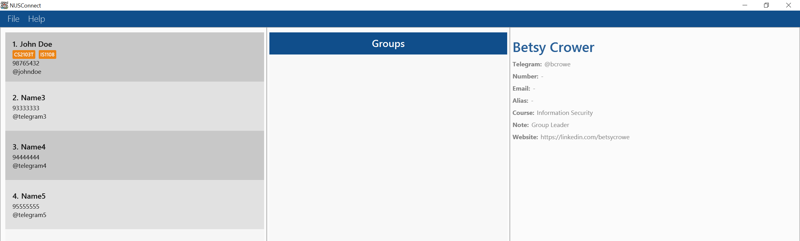
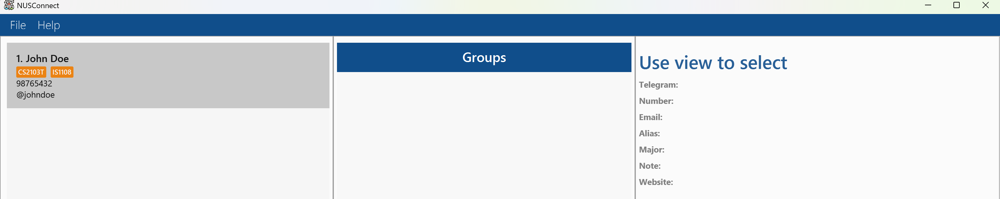
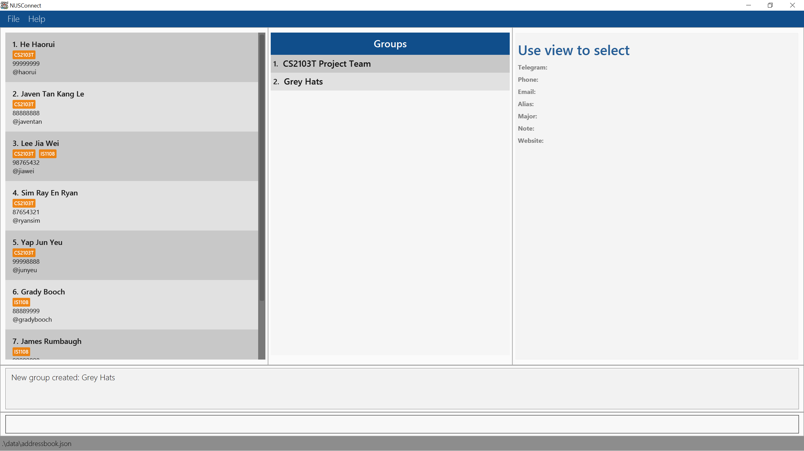
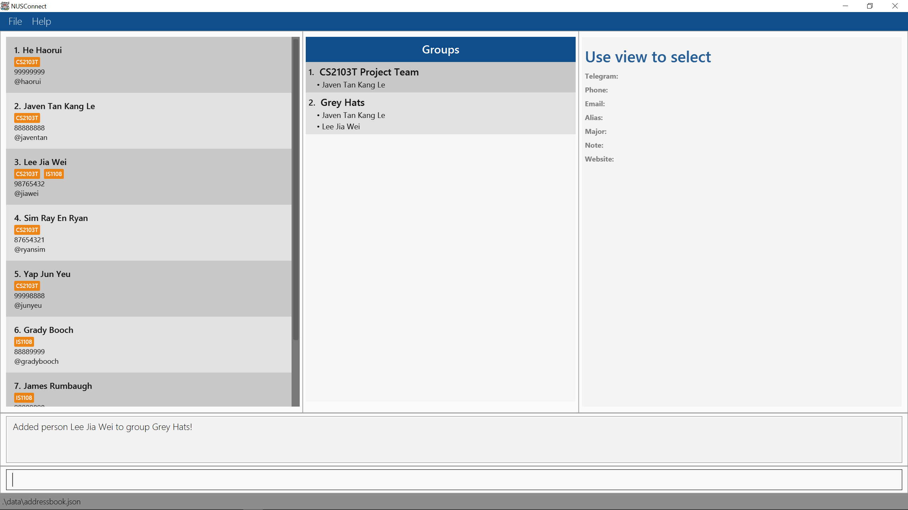
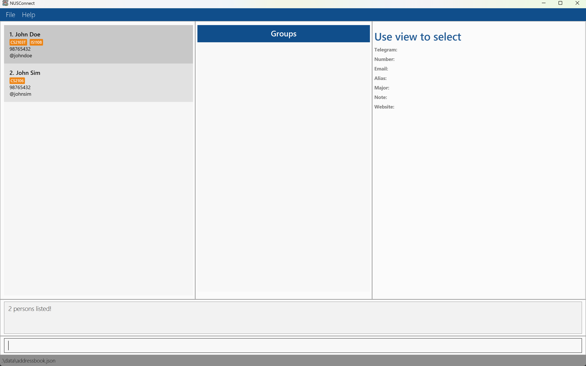

# NUSConnect

Thank you for using **NUSConnect**! With NUSConnect, you can manage your contacts quickly and efficiently using the 
Command Line Interface (CLI), all displayed with our custom-designed Graphical User Interface (GUI) specifically for 
NUS students! Type fast, and **NUSConnect** lets you breeze through contact management tasks faster than any 
traditional address book!

* Table of Contents
{:toc}

--------------------------------------------------------------------------------------------------------------------

## Quick start

1. First, make sure you have Java `17` or above installed in your computer! 
   **Mac users:** Check out [this guide](https://se-education.org/guides/tutorials/javaInstallationMac.html) to get the exact JDK version you need.

1. Next, download the latest `nusconnect.jar` file from [here](https://github.com/AY2425S2-CS2103T-T16-1/tp/releases).

1. Then, move `nusconnect.jar` to the folder where you want to keep your contacts.

1. Now, open up a command terminal, go to the folder where `nusconnect.jar` is, and use the `java -jar nusconnect.jar` command to 
   run the application. You've just taken your first step toward managing contacts quickly! 
   

1. Let's try a few commands! First, let's add your own contact to NUSConnect:
   * `add n/(your name) t/@(your handle)`
2. Let's also add your phone number, and CS2103T as a course you are taking:
   * `edit 1 p/(your number) m/CS2103T`. We use `1` as that is the number currently written beside your name.
3. Now, you can extend this to add as many contacts as you want! Let us now add in one command a groupmate John:
   * `add n/John Tan t/@johntan m/CS2103T`
4. Since you and John are group members, let's create a group and add both contacts to it!
   * `group create CS2103T Group Project`
   * `group add 1 to 1`. You have now added the first person to the first group.
   * `group add 2 to 1`. You have now added the second person to the first group.
5. Let's view John's details! Here, you will be able to see what other fields can be added to John.
   * `view 2`. 
6. But of course, once NUSConnect has been populated with real data, we do not want a "John" sticking around. Let's remove this using:
   * `delete 2`
7. Now that you are done, you may save exit NUSConnect using:
   * `exit`. 
8. For more features, refer to the [Features](#features) below!
9. Welcome to NUSConnect! We hope you will enjoy managing your contacts effortlessly!

[Back to top](#nusconnect)

--------------------------------------------------------------------------------------------------------------------

## Features

**:information_source: Notes about the command format:** 

* Words in `UPPER_CASE` are the parameters to be supplied by the user. 
  e.g. in `add n/NAME`, `NAME` is a parameter which can be used as `add n/John Doe`.

* Items in square brackets are optional. 
  e.g `n/NAME [t/TAG]` can be used as `n/John Doe t/friend` or as `n/John Doe`.

* Items with `…`​ after them can be used multiple times including zero times. 
  e.g. `[t/TAG]…​` can be used as ` ` (i.e. 0 times), `t/friend`, `t/friend t/family` etc.

* Parameters can be in any order. 
  e.g. if the command specifies `n/NAME p/PHONE_NUMBER`, `p/PHONE_NUMBER n/NAME` is also acceptable.

* Extraneous parameters for commands that do not take in parameters (such as `help`, `list`, `exit` and `clear`) will be ignored. 
  e.g. if the command specifies `help 123`, it will be interpreted as `help`.

* If you are using a PDF version of this document, be careful when copying and pasting commands that span multiple lines as space characters surrounding line-breaks may be omitted when copied over to the application.

### Address Book Operations:

#### Adding a person: `add`

Adds a person to the address book.

Format: `add n/NAME t/TELEGRAM [p/PHONE_NUMBER] [e/EMAIL] [a/ALIAS] [c/COURSE] [no/NOTE] [w/WEBSITE] [m/MODULE]…​`

:bulb: **Tip:**
A person can have any number of modules (including 0)

Examples:

After forming a group in CS2103T Software Engineering, you add your two teammates to NUSConnect:

* `add n/John Doe p/98765432 e/john@u.nus.edu a/John no/Enjoys programming t/@johndoe w/https://johndoe.com m/CS2103T`
* `add n/Betsy Crowe t/@bcrowe c/Information Security no/Group Leader w/https://linkedin.com/betsycrowe m/CS2103T`

#### Editing a person : `edit`

Edits an existing person in the address book.

Format: `edit INDEX [n/NAME] [t/TELEGRAM] [p/PHONE] [e/EMAIL] [a/ALIAS] [c/COURSE] [no/NOTE] [w/WEBSITE] [m/MODULE]…​`

* Edits the person at the specified `INDEX`. The index refers to the index number shown in the displayed person list. The index **must be a positive integer** 1, 2, 3, …​
* At least one of the optional fields must be provided.
* Existing values will be updated to the input values.
* When editing modules, the existing modules of the person will be removed i.e adding of modules is not cumulative.
* You can remove all the person’s modules by typing `m/` without
  specifying any modules after it.

Examples:

You realize that you share an additional module, IS1108 Digital Ethics and Privacy, with John. You also realize you had mispelled Betsy's name, and they have dropped CS2103T.

*  `edit 1 m/CS2103T m/IS1108` Edits the modules of the 1st person to have both CS2103T and IS1108.
*  `edit 2 n/Betsy Crower no/ m/` Edits the name of the 2nd person to be `Betsy Crower`, clears the note, and clears all existing modules.

#### Deleting people : `delete`

Deletes the specified person or a list of people from the address book.

Format: `delete INDEX [MORE_INDICES]`

* Deletes the person at the specified `INDEX`, or all people at the specified `INDICES`
* The index refers to the index number shown in the displayed person list.
* The indices **must be a positive integer** 1, 2, 3, ...
* The indices must not be larger than the size of the address book.

:bulb: **Tip:**
Duplicate indices are allowed! NUSConnect will delete the person specified at that index once.

:bulb: **Tip:**
The indices also do not have to be in any particular order!

Examples:

You heard that Betsy has dropped out of NUS, and will likely not need to keep in contact. You also do not want to keep some contacts you created to test out the features of NUSConnect.

* `find Betsy` followed by `delete 1` deletes the 1st person in the results of the `find` command.

After `list` again:

* `list` followed by `delete 2 4 3` deletes the 2nd, the 3rd, and the 4th person in the address book.

#### Clearing all entries : `clear`

Clears all entries from the address book.

Format: `clear`

### Group Operations:

#### Creating a group : `group create`

Creates a new group with the specified name.

Format: `group create NAME`

* Creates a group with the specified `NAME`
* Shown on the group panel UI

Examples:
* `group create CS2103T Team` Creates a new group named "CS2103T Team"
* `group create Grey Hats` Creates a new group named "Grey Hats"

#### Deleting a group : `group delete`

Deletes the group at the specified index.

Format: `group delete INDEX`

* Deletes the group at the specified `INDEX`.
* The index refers to the index number shown in the displayed group list.
* The index **must be a positive integer** 1, 2, 3, ...

Examples:
* `group delete 2` Deletes the 2nd group in the group list.

#### Adding a person to a group : `group add`

Adds a person to a group.

Format: `group add PERSON_INDEX to GROUP_INDEX`

* Adds the person at the specified `PERSON_INDEX` to the group at the specified `GROUP_INDEX`.
* Both indices refer to the index numbers shown in the displayed person list and group list respectively.
* Both indices **must be positive integers** 1, 2, 3, ...

Examples:
* `group add 1 to 2` Adds the 1st person in the person list to the 2nd group in the group list.

#### Group Commands: Organizing Your Project Team
You are working on a group project for CS2103T with your teammates (Betsy Crowe, John Smith and Michael Tan). You have already
added all of them to NUSConnect. However, with many other contacts in your address book, it is hard to remember who 
exactly is in which project. To quickly identify and see who is in your team at a glance, you decide to use the group feature.

1. Creating the Group
   
* `group create CS2103T Project Team` creates a new group.

2. Adding Teammates to the Group
   
* Suppose in your person list:
  * Betsy is at index `2`.
  * John is at index `3`.
  * Michael is at index `5`.
* Under group list "CS2103T Project Team" is the first group.
* `group add 2 to 1` adds Betsy to the group.
* `group add 3 to 1` adds John to the group.
* `group add 5 to 1` adds Michael to the group.

3. Cleaning Up the Group
   
* After the semester ends, you no longer need "CS2103T Project Team".
* To keep the list organize you decide to delete it.
* If the group is listed as the first group, `group delete 1` deletes it.
* Your contacts remain in NUSConnect, but they are no longer grouped under “CS2103T Project Team.”

### Address Book Organization:

#### Listing all persons : `list`

Shows a list of all persons in the address book.

Format: `list`

#### Locating persons by name or modules: `find`

Finds persons whose names or modules contain any of the given keywords.

Format: `find KEYWORD [MORE_KEYWORDS]`

* The search is case-insensitive. e.g `hans` will match `Hans`
* The order of the keywords does not matter. e.g. `Hans Bo` will match `Bo Hans`
* Both the name and the module are searched.
* Partial words can be matched e.g. `Han` will match `Hans`
* Persons matching at least one keyword in either the name or module will be returned (i.e. OR search). e.g. `Hans Bo CS2103T` will return `Hans Gruber` (matching `Hans`), `Bo Yang` (matching `Bo`), and `John Sim` (if module matches).

Examples:
* `find John` returns `john` and `John Doe`
* `find alex david` returns `Alex Yeoh`, `David Li` 
* `find tim` returns `Tim Yeoh`, `Timothy Lim`
* `find doe CS2106` returns `John Doe` (matching name `Doe`) and `John Sim` (matching module `CS2106`)
  

#### Viewing contact details: `view`

Shows the details of the specified person from the address  book.

Format: `view INDEX`

* Shows the full details of the person at the specified `INDEX` on the right panel.
* The index refers to the index number shown in the displayed person list.
* The index **must be a positive integer** 1, 2, 3, ...
* The index must not be larger than the size of the address book.

Examples:
* `list` followed by `view 2` shows the full details of the 2nd person in the address book.
* `find Betsy` followed by `view 1` shows the full details of the 1st person in the results of the `find` command.

#### Sorting the address book: `sort`

Sorts all the persons in the address book by their names in alphabetical order.

Format: `sort`

* The  `sort` command organises all the contacts in the address book by their names in ascending alphabetical order.
* If the address book is empty, the command will display the message `The address book is empty!`.
* If there is only one person in the address book, the list will remain unchanged, and the command will display the message `Sorted one person!`.

Examples:
* Before sorting:

* After sorting:

### Storage:

#### Saving the data

AddressBook data are saved in the hard disk automatically after any command that changes the data. There is no need to save manually.

#### Editing the data file

AddressBook data are saved automatically as a JSON file `[JAR file location]/data/addressbook.json`. Advanced users are welcome to update data directly by editing that data file.

:exclamation: **Caution:**
If your changes to the data file makes its format invalid, AddressBook will discard all data and start with an empty data file at the next run. Hence, it is recommended to take a backup of the file before editing it. 
Furthermore, certain edits can cause the AddressBook to behave in unexpected ways (e.g., if a value entered is outside of the acceptable range). Therefore, edit the data file only if you are confident that you can update it correctly.

#### Exporting the current address book: `export`

Exports the current address book data to a specified file.

format: `export FILE_PATH`

* FILE_PATH refers to the location where the data will be exported.
* The filename can be empty (i.e., the user only provides a path without a filename).
* File extension provided by user will be ignored and the default (.json) extension will be used.
* If a file already exists at the specified location, it will be overwritten with the current data.
* If the file path is invalid or there are issues with writing the file (e.g., insufficient permissions), an error message will be displayed.

Examples:

* export exported_data.txt exports the address book data to the exported_data.txt file in the current directory.
* export /Users/user/Downloads/addressbook_backup.json exports the address book data to a specific location on your system.

#### Importing an address book: `import`

Format: import FILE_PATH

* FILE_PATH refers to the path of the file from which data will be imported. It can be either an absolute or relative path.
* The file must be in the correct format (e.g., .json, .txt), and it must contain data that is compatible with the address book structure.
* If the file path is invalid, the operation will fail, and an error message will be displayed.
* If the data in the file is successfully imported, the address book will be updated with the new information.

Examples:

* import data.json imports data from the data.json file.
* import ./backup/addressbook.json imports data from the addressbook.json file located in the backup folder.
* import /Users/user/Documents/addressbook_data.txt imports data from the addressbook_data.txt file located in the specified directory.

### Misc:

#### Viewing help : `help`

Shows a message explaning how to access the help page. This message can also be brought up using `F1`

Format: `help`

#### Exiting the program : `exit`

Exits the program.

Format: `exit`

* [Back to top](#nusconnect)
--------------------------------------------------------------------------------------------------------------------

## FAQ

**Q**: How is my data being used? 
**A**: All data is stored locally and is not collected or shared with external parties.

**Q**: Can I use NUSConnect without an internet connection? 
**A**: Yes, NUSConnect is a desktop application that operates fully offline. No internet connection is required to manage your contacts.

**Q**: How do I transfer my data to another Computer? 
**A**: Install the app in the other computer and overwrite the empty data file it creates with the file that contains the data of your previous AddressBook home folder.

**Q**: Can I undo a command if I delete or modify the wrong contact? 
**A**: Currently, there is no undo feature in NUSConnect. It is recommended to back up your address book data regularly to prevent accidental data loss.

* [Back to top](#nusconnect)

--------------------------------------------------------------------------------------------------------------------

## Known issues

1. **When using multiple screens**, if you move the application to a secondary screen, and later switch to using only the primary screen, the GUI will open off-screen. The remedy is to delete the `preferences.json` file created by the application before running the application again.
2. **If you minimize the Help Window** and then run the `help` command (or use the `Help` menu, or the keyboard shortcut `F1`) again, the original Help Window will remain minimized, and no new Help Window will appear. The remedy is to manually restore the minimized Help Window.

* [Back to top](#nusconnect)
--------------------------------------------------------------------------------------------------------------------

## Command summary

Action | Format, Examples
--------|------------------
**Add** | `add n/NAME t/TELEGRAM [p/PHONE_NUMBER] [e/EMAIL] [a/ALIAS] [c/COURSE] [no/NOTE] [w/WEBSITE] [m/MODULE]…​`   e.g., `add n/John Doe t/@johndoe p/98765432 e/johnd@example.com a/alias123 c/CompSci no/Enjoys programming w/https://johndoe.com m/CS2103T`
**Edit** | `edit INDEX [n/NAME] [t/TELEGRAM] [p/PHONE] [e/EMAIL] [a/ALIAS] [c/COURSE] [no/NOTE] [w/WEBSITE] [m/MODULE]…​`  e.g.,`edit 2 n/James Lee e/jameslee@example.com`
**Delete** | `delete INDEX [MORE_INDICES]`  e.g., `delete 3` `delete 1 3 5`
**Clear** | `clear`
**Group create** | `group create NAME`  e.g., `group create CS2103T Team`
**Group delete** | `group delete INDEX`  e.g., `group delete 2`
**Group add** | `group add PERSON_INDEX to GROUP_INDEX`  e.g. `group add 1 to 2`
**List** | `list`
**Find** | `find KEYWORD [MORE_KEYWORDS]`  e.g., `find James Jake`
**View** | `view INDEX`   e.g., `view 1`
**Sort** | `sort`
**Export** | `export`
**Import** | `import`
**Help** | `help`
**Exit** | `exit`

* [Back to top](#nusconnect)
